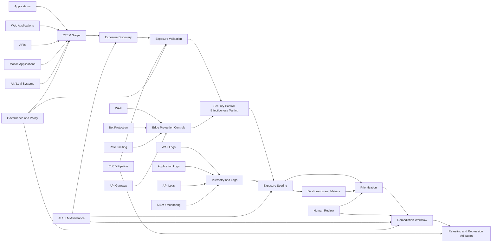

# CTEM Reference Architecture

## Overview

This diagram shows the initial reference architecture for the OWASP CTEM Blueprint.

The architecture connects continuous exposure validation across applications, APIs, mobile applications, AI/LLM systems, CI/CD pipelines, security controls, telemetry, and remediation workflows.

## Architecture Principles

- CTEM is continuous, not point-in-time.
- Exposure must be validated, not only identified.
- Security controls must be tested for real-world effectiveness.
- CI/CD pipelines should include exposure validation gates.
- Telemetry should support exposure scoring and prioritisation.
- AI/LLM assistance must remain human-reviewed.
- Defensive validation must be vendor-neutral and controlled.

## Core Components

| Component | Purpose |
|---|---|
| CTEM Scope | Defines assets, systems, applications, APIs, mobile, and AI/LLM areas in scope |
| Exposure Discovery | Identifies possible exposed surfaces and attack paths |
| Exposure Validation | Confirms whether an exposure is realistically exploitable |
| Security Control Testing | Validates whether controls such as WAF, bot protection, and monitoring work |
| Exposure Scoring | Scores exposure using likelihood, impact, and exploitability |
| CI/CD Integration | Replays validation checks during build and release workflows |
| Telemetry and Logs | Provides evidence for detection, scoring, and validation |
| Dashboards and Metrics | Tracks exposure, control effectiveness, and remediation progress |
| Human Review | Ensures defensive validation, prioritisation, and remediation decisions remain governed |